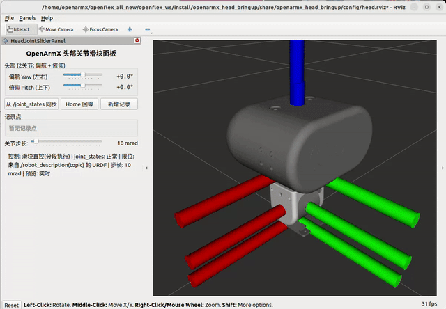

# openarmx_head_joint_slider_panel

[English](./README.md) | 中文

---




用于 OpenArmX 头部关节（偏航和俯仰）滑块控制的 RViz2 面板插件。

## 概述

本包实现了一个 RViz2 面板插件（`rviz_common::Panel`），允许通过滑块直接控制 OpenArmX 头部的两个关节。向 `head_forward_position_controller` 发布位置指令，支持分段步进执行、实时 TF 预览、关节位置记录/回放，以及与当前机器人状态的自动同步。

## 功能特性

- **滑块控制**：偏航和俯仰两个滑块，实时显示角度读数
- **分段步进执行**：指令按可配置的步长（1-200 mrad/周期，50 Hz）增量发送，确保运动平滑
- **自动同步**：收到第一条 `/joint_states` 消息时，滑块自动同步到当前机器人位置
- **手动同步**："从 /joint_states 同步" 按钮，可随时重新同步
- **Home 回零**：平滑地将所有关节移至零位，带确认对话框
- **记录点**：保存当前关节位置为航点；可运动到任意记录点
- **实时 TF 预览**：在执行运动前发布预览坐标变换，在 RViz 中可视化目标姿态
- **URDF 感知关节限位**：自动读取 `robot_description` 设置滑块范围；缺失时 Yaw 回退到 +/-90 度，Pitch 回退到 -62.2～+23.1 度
- **持久化记录**：记录点保存/加载自 RViz 配置文件和备用设置文件

## 插件信息

- **插件名称**：`openarmx_head_joint_slider_panel/HeadJointSliderPanel`
- **基类**：`rviz_common::Panel`
- **插件类型**：RViz2 面板

## 编译

```bash
cd ~/openflex_ws
colcon build --packages-select openarmx_head_joint_slider_panel
source install/setup.bash
```

## 使用方式

1. 启动头部 bringup：
   ```bash
   ros2 launch openarmx_head_bringup head.launch.py
   ```

2. 在 RViz2 中添加面板：
   - Panels -> Add New Panel -> openarmx_head_joint_slider_panel / HeadJointSliderPanel

3. 面板将会：
   - 自动从 URDF 检测关节限位
   - 从 `/joint_states` 同步滑块位置
   - 允许通过滑块操作直接控制头部

## 订阅话题

| 话题 | 类型 | 描述 |
|------|------|------|
| `/joint_states` | `sensor_msgs/JointState` | 当前关节位置，用于同步 |
| `/robot_description` | `std_msgs/String` | URDF，用于提取关节限位（transient local QoS） |

## 发布话题

| 话题 | 类型 | 描述 |
|------|------|------|
| `/head_forward_position_controller/commands` | `std_msgs/Float64MultiArray` | 位置指令 [yaw, pitch]（弧度） |

## TF 发布

预览坐标变换以带前缀的坐标系名称发布（`preview_<link_name>` 和 `preview_/<link_name>`），用于在 RViz 中可视化目标姿态而不移动实际机器人模型。

## 配置

面板通过 RViz 配置保存/恢复以下内容：
- `joint_step_mrad`：步长，单位毫弧度（1-200）
- `record_targets`：序列化的记录点

备用设置文件：`~/.config/OpenArmX/HeadJointSliderPanel.conf`

## 依赖

- `rclcpp`、`rviz_common`、`pluginlib`
- `sensor_msgs`、`std_msgs`、`geometry_msgs`
- `tf2_ros`、`urdf`、`kdl_parser`
- Qt5（Core、Widgets）

## 前置条件

- `openarmx_head_bringup` 必须正在运行（提供 controller_manager、joint_state_broadcaster 和 forward_position_controller）。
- RViz2 必须正在运行以承载此面板。

## 许可证

本作品采用知识共享 署名-非商业性使用-相同方式共享 4.0 国际许可协议 (CC BY-NC-SA 4.0) 进行许可。

版权所有 (c) 2026 成都长数机器人有限公司 (Chengdu Changshu Robot Co., Ltd.)

详情请参阅 [LICENSE_CN.md](LICENSE) 文件或访问：http://creativecommons.org/licenses/by-nc-sa/4.0/

## 致谢

本包是 OpenArmX 机器人平台生态系统的一部分，专为协作机器人领域的研究和工业应用而开发。

---

## 📞 联系我们

### 成都长数机器人有限公司
**Chengdu Changshu Robotics Co., Ltd.**

| 联系方式 | 信息 |
|---------|------|
| 📧 邮箱 | openarmrobot@gmail.com |
| 📱 电话/微信 | +86-17746530375 |
| 🌐 官网 | <https://openarmx.com/> |
| 🌐 文档 | <http://docs.openarmx.com/> |
| 📍 地址 | 天津经济技术开发区西区新业八街11号华诚机械厂 |
| 👤 联系人 | 王先生 |
